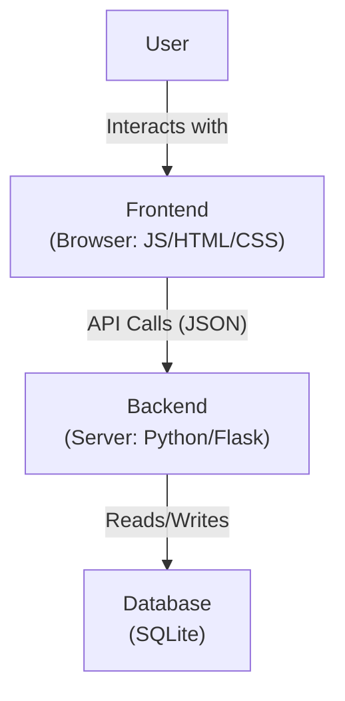
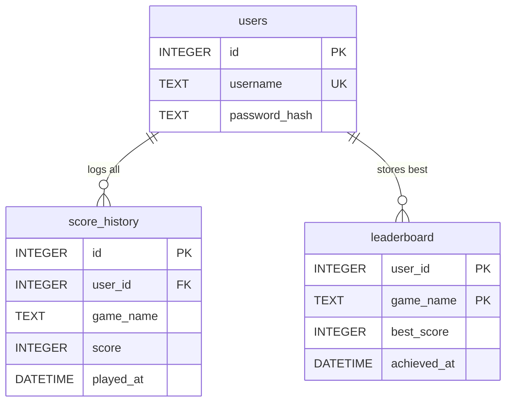
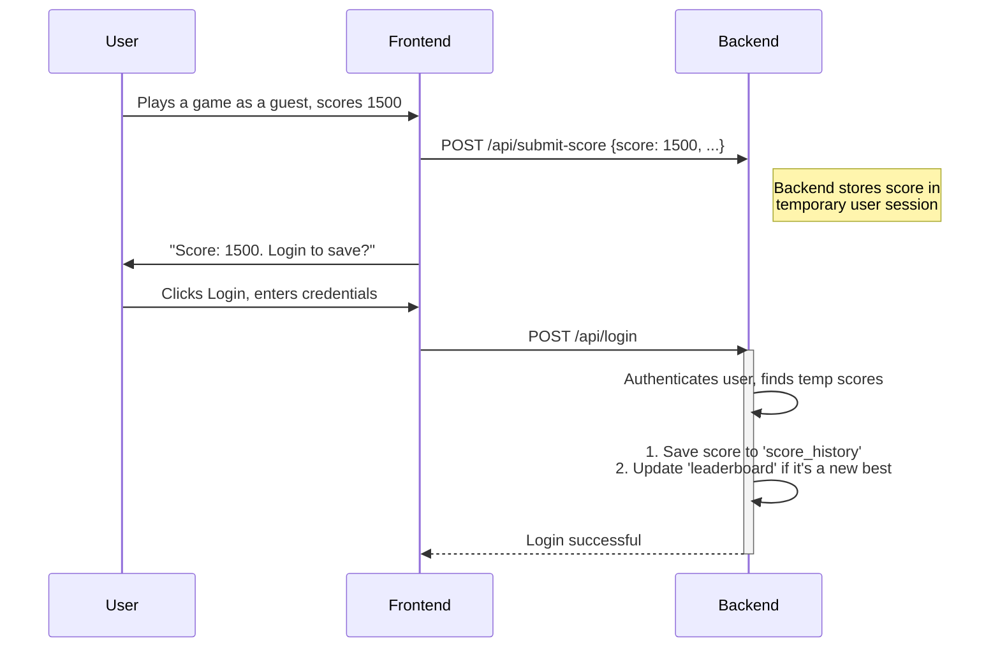

## Design Document: The Retro Arcade Hub (Final Draft)

### 1. Project Goal

To build a web app with classic arcade games (Pong, Snake, etc.) playable on PC and mobile. The core features are guest gameplay with an option to register and save scores to a secure leaderboard. This is an educational project focused on learning the full web stack.

### 2. Core Features

*   **Guest Play:** Anyone can play immediately without an account.
*   **User Accounts:** Optional user registration and login.
*   **Score Persistence:** Logged-in users can save their scores. Guest scores are held temporarily during the session and can be saved upon login.
*   **Leaderboards:** A separate leaderboard for each game showing the best score for each registered player.

### 3. Architecture

#### 3.1. High-Level Diagram

#### 3.2. Component Breakdown

*   **Frontend:**
    *   **Tech:** Vanilla HTML/CSS/JS for UI, **Kaboom.js** for games.
    *   **Responsibilities:** Render all pages, run game logic, handle user input. Makes API calls to the backend. Game scripts will be **lazy-loaded** on demand for faster initial page load.

*   **Backend:**
    *   **Tech:** **Python** with the **Flask** framework.
    *   **Responsibilities:** Provide a JSON API. Handle user authentication (registration, login, sessions). Process game scores and manage the database.

*   **Database:**
    *   **Tech:** **SQLite**.
    *   **Responsibilities:** A single file (`database.db`) storing all persistent data.

### 4. Database Schema

We'll use two tables for scores to separate raw data from clean leaderboard data.

*   **`score_history`**: The "source of truth." A log of every single game played by a registered user.
*   **`leaderboard`**: A clean summary table. The composite `PRIMARY KEY` of `(user_id, game_name)` ensures it contains only the single best score for each user in each game. This makes fetching leaderboards extremely fast.

### 5. API Endpoints

| Endpoint | Method | Protected? | Description |
| :--- | :--- | :--- | :--- |
| `/api/register` | POST | No | Create a new user. |
| `/api/login` | POST | No | Log in and start a session. |
| `/api/logout` | POST | **Yes** | Log out. |
| `/api/status` | GET | No | Check current login status. |
| `/api/submit-score` | POST | No | Submits a score from a session (guest or logged in). |
| `/api/leaderboard/<game_name>`| GET | No | Get top 10 scores for a game. |

### 6. Key User Flow: Guest to Registered Player

This flow is central to our design.

### 7. Development Roadmap

1.  **Phase 1: Frontend Shell.** Build the static HTML/CSS pages: Home/Lobby, Leaderboard, Game Page (empty), Login/Register.
2.  **Phase 2: Frontend Logic.** Add JavaScript to handle page navigation. Make forms and buttons send dummy data to the (not yet built) API endpoints.
3.  **Phase 3: Backend Core.** Build the Flask server. Implement all API endpoints and database logic.
4.  **Phase 4: Integration.** Connect the frontend and backend. The site should be fully functional with dummy game data.
5.  **Phase 5: Game Development.** Use Kaboom.js to build the actual games and integrate them into the empty game pages.

### 8. Future Goals

*   Real-time PVP modes (e.g., Pong).
*   Player ranking/ELO system.
*   User profile pages with game statistics.
*   Secure score submission to prevent cheating.